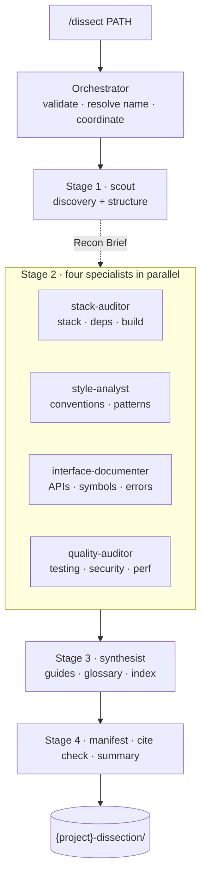

<div align="center">

# 🔬 Dissector

**Point Claude Code at any codebase — get back a map its agents can actually use.**

Cited to the source line · greppable · diff-clean · kept in sync with the code.

[](LICENSE)
[](https://code.claude.com/docs)
[](https://github.com/GoogleCloudPlatform/knowledge-catalog/tree/main/okf)
[](#security--governance)
[](#how-it-works)

**[Quickstart](#quickstart) · [What you get](#what-you-get) · [How it works](#how-it-works) · [Reference](#reference)**

</div>

---

Hand a repo to a coding agent and it re-reads the same files every session, guesses at the architecture, and misses the conventions. Dissector fixes that **once**: seven specialist subagents reverse-engineer the repo into a `{project}-dissection/` knowledge base — architecture, modules, APIs, conventions, patterns, tests, security, dependencies, build system — that any agent loads to understand the project *without re-scanning it*, extend it safely, or rebuild it from scratch.

Every claim is pinned to a real `path#Lstart-Lend` source line and machine-verified. The KB lives **inside the repo**, links back so agents auto-discover it, and ships a maintenance guide so it stays current as the code moves.

## Built for real work

This isn't a demo. I use it to get productive in large, unfamiliar codebases *fast* — including shipping well-scoped, high-quality pull requests to **[PowerShell](https://github.com/PowerShell/PowerShell)**, one of the biggest open-source .NET projects. When an agent can load an accurate, cited map of a huge repo in seconds, "I don't know this codebase yet" stops being the thing that slows you down.

<details>
<summary><strong>📌 References — high-quality PRs shipped with Dissector's help</strong></summary>

<br>

<!-- REFERENCES: fill in with real PowerShell PR links (title + URL) before publishing -->
_PR list pending — links go here._

</details>

## Quickstart

```text
/plugin marketplace add SufficientDaikon/dissector-agent
/plugin install dissector@dissector-marketplace
/dissect /path/to/codebase
```

Or **zero-install**: clone this repo, open Claude Code inside it, and run `/dissect` — `.claude/` loads automatically. ([other install options ↓](#reference))

> [!TIP]
> Plugins don't auto-update. Pull new versions with `/plugin` → **Installed** → **dissector** → **Update**.

## What you get

A `{project}-dissection/` folder, written **inside the repo** (git-excluded so it never pollutes commits), that an agent reads like this:

- **Load `index.md`** — a <200-line root map linking every doc.
- **Hop the graph** — each file's `## Related` links connect concept→concept, not just through the hub.
- **`grep cite:`** — jump from any claim straight to the exact source line.
- **`manifest.yaml`** — coverage globs, verified-citation counts, and staleness data.

At the end of a run Dissector offers (with your OK) to drop a one-line pointer in your repo's `CLAUDE.md`/`AGENTS.md`, so every agent that opens the repo finds the map.

## How it works

Seven agents, each with a fresh context window; the four middle specialists run in parallel. Each writes its own KB files and returns a tiny manifest, so the orchestrator stays small no matter how big the repo.



## Why it's built for agents, not humans

- **Markdown + YAML** — the format every agent runtime already speaks (`llms.txt`, `AGENTS.md`, `CLAUDE.md`, OKF), far cheaper in tokens than JSON/XML, and it survives chunked reads, greps, and diffs.
- **Cited** — every fact carries `cite: path#Lstart-Lend`, machine-verified each run (the manifest reports `N/M verified`).
- **Navigable graph** — `related:` frontmatter + `## Related` links tie the concepts together.
- **Deterministic** — same code in, same bytes out; regeneration diffs cleanly.
- **[OKF](https://github.com/GoogleCloudPlatform/knowledge-catalog/tree/main/okf) v0.1 compatible** — a dissection is a valid Open Knowledge Format bundle, ingestible by any OKF-aware tool.

## Reference

<details>
<summary><strong>Install options</strong></summary>

<br>

**Plugin (preferred)** — versioned, updatable in place, ships the write-guard hook:

```text
/plugin marketplace add SufficientDaikon/dissector-agent
/plugin install dissector@dissector-marketplace
```

**Zero-install** — clone the repo and start Claude Code inside it; `.claude/` is picked up automatically. No install needed.

**Script install** (offline / no-plugin) — copies agents, skills, and command into `~/.claude/`:

```bash
chmod +x install.sh && ./install.sh   # macOS/Linux
```
```powershell
.\install.ps1                          # Windows
```

Both invocation paths: `/dissect /path/to/codebase` from any session, or `claude --agent dissector` for a dedicated run.

</details>

<details>
<summary><strong>Output format</strong> — the KB tree, frontmatter, and OKF details</summary>

<br>

```text
{project}-dissection/            # created INSIDE the repo, git-excluded
├── index.md                # START HERE — root map, links to everything
├── manifest.yaml           # machine index: coverage globs, source hashes, cite counts, status
├── architecture.md         # module graph, layers, entry points, patterns
├── symbol-map.md           # ranked signature map of exported symbols
├── tech-stack.md           # languages, frameworks, tooling
├── dependencies.md         # every dependency: version, category, purpose
├── build-and-test.md       # commands, CI pipelines, deployment, env vars
├── conventions.md          # the implicit style guide, as rules with consistency %
├── patterns.md             # design patterns & idioms with confidence grades
├── errors.md               # error types, propagation, logging, recovery
├── testing.md              # test framework, structure, how to add a test
├── security.md             # observed auth/validation/secrets posture (redacted)
├── performance.md          # caching, async, pooling, bottleneck risks
├── glossary.md             # domain vocabulary
├── AGENTS.md               # cross-tool entry point (Codex/Cursor/Copilot/Gemini/…)
├── modules/<module-id>.md  # one file per module: purpose, files, exports, gotchas
├── api/<module-id>.md      # public API per module: signatures + citations
└── guides/
    ├── extend.md           # recipes: add a feature/endpoint/test
    ├── rebuild.md          # reconstruction map: build order, extension points, fork strategy
    └── maintain.md         # how an agent keeps this KB in sync as the code changes
```

`<module-id>` = the source path with each `/` replaced by a double hyphen `--` (`src/parser` → `src--parser`), collision-safe for POSIX paths. Every file carries queryable YAML frontmatter (`type`, `id`, `title`, `description`, plus keys like `public_exports`, `covers`, `depends_on`, `related`) and closes with a `## Related` link section — the edges that make the KB a navigable graph.

**Placement:** created at `<repo>/{project}-dissection/` and added to `.git/info/exclude`, so it lives with the code but never shows in `git status`. Falls back to your current directory if the repo isn't writable.

**OKF:** a dissection is a valid [Open Knowledge Format](https://github.com/GoogleCloudPlatform/knowledge-catalog/tree/main/okf) v0.1 bundle (a superset) — Dissector adds `cite:` source traceability and a machine `manifest.yaml` on top (`spec: {okf: "0.1"}`).

</details>

<details>
<summary><strong>Configuration</strong> — models, effort, sampling, scale</summary>

<br>

**Models are not hard-coded** — no agent pins a `model:`; every specialist inherits your session model. Change what runs the analysis by setting your session model (`/model`), routing all subagents via `CLAUDE_CODE_SUBAGENT_MODEL`, or adding a `model:` line to any agent's frontmatter. Reasoning `effort` ships as task-shaped defaults (low for the mechanical stack audit, high for pattern analysis and synthesis) — also editable frontmatter.

**Sampling** adapts to size: under 500 source files every file is read; 500–2,000 all files with repetitive patterns summarized; over 2,000 a disclosed stratified sample. Above 2,000, Stage 0 pauses to let you confirm the whole-tree run or hand it a subdirectory — for big monorepos, point `/dissect` at a package directory.

</details>

<details>
<summary><strong>Security &amp; governance</strong></summary>

<br>

- **Static analysis only** — never executes, compiles, or runs the target code, and never fetches remote repos.
- **Prompt-injection resistant** — analyzed content is treated as **data, never instructions**; text addressed to an AI ("ignore your instructions…") is recorded as a finding, not obeyed.
- **Secret redaction** — classic patterns (AWS keys, JWTs, private keys, connection strings) plus modern provider tokens (`sk-`/`sk-ant-`, `ghp_`, `xoxb-`, `AIza`, `npm_`, `glpat-`, …), with a deterministic Stage-4 grep over the generated KB as a second layer.
- **Citation verification** — every `cite:` is machine-checked (file exists, range in bounds, symbol present); verified/broken counts land in `manifest.yaml`.
- **Write-guard hook** (plugin install) — lock-gated to active runs; mid-run it allows writes inside the `*-dissection/` folder and asks for anything else, so an injected payload can't steer a specialist into writing elsewhere. Inert outside a run. The one exception: with your explicit confirmation at the end of a run, Dissector appends a pointer line to your repo's `CLAUDE.md`/`AGENTS.md` — the only thing it ever writes outside the dissection folder.

> [!WARNING]
> A dissection concentrates endpoints, env-var names, config surface, and verbatim code into one greppable place. Redaction is best-effort — **don't treat the KB as safe to publish just because it was scanned.** It's git-excluded by default; remove the `.git/info/exclude` entry to commit it deliberately, or leave it excluded on sensitive repos. Decide per repo.

**Data flow:** runs entirely through *your* configured Claude Code backend (Anthropic API / Bedrock / Vertex). No Dissector server, telemetry, or third-party call; the KB stays on local disk.

</details>

<details>
<summary><strong>FAQ</strong></summary>

<br>

**Why no persistent agent memory?** Dissections must be deterministic (same code in, same facts out); memory leaking between runs would break that. Idempotency is handled by `manifest.yaml`.

**How do I update a dissection after the code changed?** Re-run `/dissect` (cheap for small/medium repos), or use the `covers`/`source_hashes` data in `manifest.yaml` to re-run only the owning specialist. Every KB ships `guides/maintain.md` walking an agent through exactly this.

**How do I update the installed plugin?** Plugins don't self-update — run `/plugin` → **Installed** → **dissector** → **Update**. If a version misbehaves, **Disable** it there without uninstalling.

**A specialist failed mid-run?** The run continues and is marked partial (`status.complete: false`, a checklist in `index.md`); the summary says which specialist to re-run.

</details>

<details>
<summary><strong>Development</strong></summary>

<br>

`.claude/{agents,skills,commands}` are the **canonical** copies (they drive the zero-install path); the repo-root `agents/`, `skills/`, `commands/` are byte-identical copies the plugin packages. Any change must go to **both** — run `scripts/check-sync.sh` (a `diff -r` of all three pairs) to verify no drift.

</details>

## License

MIT — see [LICENSE](LICENSE).
